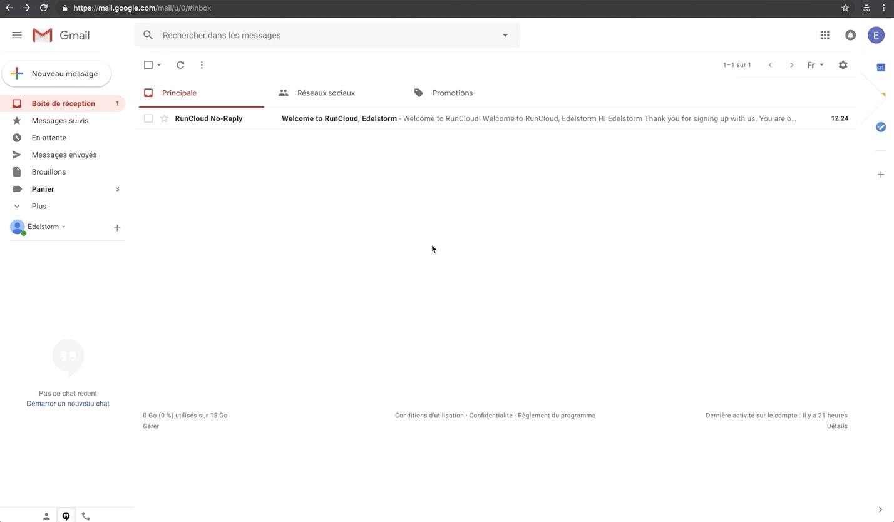

# Run Cloud <small>- AWS</small>

## Sign up

!!! info "Runcloud.io"

    Runcloud is a service that offers a secure and easy way to spread PHP apps. The goal of this step is to connect your Lightsail instance to the Runcloud.io interface so we can install and configure Wordpress on it.

<p><a href="../assets/images/aws/run-cloud/en/1.gif" target="_blank"></a></p>

***

**Go to <a href="https://runcloud.io/" target="_blank">RunCloud.io</a>**

!!! info "AWS instance windows"
    Keep a window open on your Lightsail instance page. You will need to copy/paste your instance static IP address.

:    * Click on {==Sign Up==} at the top right.
:    * Fill the form and click on {==Create Free Account==}.

***

<p><a href="../assets/images/aws/run-cloud/en/2.gif" target="_blank"></a></p>

***

:    * Confirm your account by clicking on {==Verify Registration==} in the email you just received.
:    * Connect to your account with your login and passwords by clicking on {==Sign in to Dashboard==}.

!!! success "You now have a Runcloud.io account!"

***

## Installation

***

<iframe width="100%" height="405" src="https://www.youtube-nocookie.com/embed/cAwNQjCvDm4?rel=0" frameborder="0" allow="accelerometer; autoplay; encrypted-media; gyroscope; picture-in-picture setPlaybackQuality(hd1080);" allowfullscreen></iframe>

***

**Install Runcloud on your Lightsail instance**

:    * Click on *Connect a New Server*.
:    * Name your server with your website name.
:    * Copy/paste the static IP of your instance in the form input.
:    * Put *AWS* as a Server Provider.
:    * Click on {==Connect this server==}.
:    * RunCloud is going to generate an installation command on your server. Copy it by clicking on the green icon on the right.
:    * Go back on Lightsail and connect to your SSH instance by clicking on *Connect*.
:    * Once you are in the instance terminal, type the command below to obtain the admin rights, then press <kbd>Enter</kbd>.
``` sh
sudo su
```

:    * Click on the orange icon at the bottom right of the terminal and paste the installation command in the window.
:    * Click on the black part of the terminal, do a right click to paste the command inside, then press <kbd>Enter</kbd>.


!!! warning "Installation"

    The command is going to install Runcloud. DO NOT LEAVE the terminal before the process is done. It can take around 10 minutes.

***

<iframe width="100%" height="405" src="https://www.youtube-nocookie.com/embed/0efKMExFMfY?rel=0" frameborder="0" allow="accelerometer; autoplay; encrypted-media; gyroscope; picture-in-picture setPlaybackQuality(hd1080);" allowfullscreen></iframe>

***

**Save your MySQL credentials**

:    *  Once the process is done, copy the MySQL login and password and paste it on a secure document on your computer! To copy on a terminal, you have to select what you want to copy, then click on the orange icon at the bottom right. You will find what you just select. You can now from this place, copy the content.

!!! success "You now have access to the admin interface of your Runcloud.io instance!"

***

## Application's creation

<iframe width="100%" height="405" src="https://www.youtube-nocookie.com/embed/2jrRYXP-3k4?rel=0" frameborder="0" allow="accelerometer; autoplay; encrypted-media; gyroscope; picture-in-picture setPlaybackQuality(hd1080);" allowfullscreen></iframe>

***

**Come back to Runcloud.io, you should now have access to your dashboard**

:    * In the left menu, click on {==Web Application==}.
:    * Click on {==Create Application==}.
:    * Name your application with the name of your future website this way : `*.VotreNomDeDomaine.com`
:    * Add the domain name that you use for your instance.
:    * Choose the User by default *Runcloud*.
:    * Leave the by default Public Path.
:    * Select the most recent PHP version.
:    * Select *NGINX + Apache2 Hybrid (You will be able to use .htaccess)*.
:    * Choose the *Production* mode.
:    * Let the *Advanced Settings* box unchecked, so you can keep the by default settings.
:    * Click on {==Add Web Application==}.

!!! success "A space for an application is now available on your Lightsail instance."

***

## Configurations

<iframe width="100%" height="405" src="https://www.youtube-nocookie.com/embed/E8IpVG2c9-Q?rel=0" frameborder="0" allow="accelerometer; autoplay; encrypted-media; gyroscope; picture-in-picture setPlaybackQuality(hd1080);" allowfullscreen></iframe>

***

**Wordpress installation**

:    * On the left menu, click on {==Script Installer==}.
:    * Select the *Wordpress* script.
:    * Click on {==Install==}.

***

**Domain name configuration**

:    * In the left menu, click on {==Domain Name==}.
:    * Add the domains names `www.example.com` and `example.com` to the existing list.
:    * Click on {==Attach Domain Name==}.

***

**Creation of the SSL security certificate**

:    * In the left menu, click on {==SSL/TLS==}.
:    * Check the box *Enable HSTS*.
:    * Select *Let's Encrypt* as an SSL method.
:    * Select *Http-01*.
:    * Select *Live* as an environment.
:    * Click on {==Submit==}.

!!! success "Wordpress is now installed on your Lightsail instance. The domain name configuration is correct and the SSL security certificate is now activated."

***

## Database

<iframe width="100%" height="405" src="https://www.youtube-nocookie.com/embed/Wb7_7h03Zgc?rel=0" frameborder="0" allow="accelerometer; autoplay; encrypted-media; gyroscope; picture-in-picture setPlaybackQuality(hd1080);" allowfullscreen></iframe>

***

**Database creation**

:    * Come back to the homepage by clicking on *Back to web apps*.
:    * In the left menu, click on {==Database==}.
:    * Click on *Create Database*.
:    * Name your database as you wish.
:    * Leave the field *Collation* empty by default.
:    * Click on {==Add Database==}.

!!! info "Information"

    Your app (Wordpress) needs a database to function. It will stock your website's and your user's information.

***

**Database admin user creation**

:    * Click on *Create Database User*.
:    * In *Database User*, create your login, save it in a separate file and store it in a secured place.
:    * Generate a password and copy/paste, save it in a separate file and store it in a secured place.
:    * Click on *Add Database User*.

!!! info "Information"
    
    You need an admin account to access the Wordpress dashboard. This account will have all the rights on your website. Once the admin login/password created, you must keep it in a secure place/file.

***

**Linking the admin account to your database**

:    * Click on *Attach User*.
:    * Select the admin username in the drop-down list.
:    * Click on *Attach User*.

!!! success "The database linked to an admin account is now available for Wordpress."

***

## Cron Job Let's Encrypt

<iframe width="100%" height="405" src="https://www.youtube-nocookie.com/embed/TvcAU5hLn-Y?rel=0" frameborder="0" allow="accelerometer; autoplay; encrypted-media; gyroscope; picture-in-picture setPlaybackQuality(hd1080);" allowfullscreen></iframe>

***

**Security certificate Let's Encrypt automatic task renewal**

:    * Click on {==Cron Job==} in the left menu.
:    * Click on{==Create a Cron Job==}.
:    * Name your Cron Job: *Let's Encrypt*.
:    * Copy the command below and paste it in the command field:
``` yaml
cd /etc/letsencrypt/ && ./certbot-auto renew && /etc/init.d/apache2 restart
```

:    * Define the predefined settings on *Every 10 days at midnight*.
:    * Click on{==Add a Cron Job==}.

!!! success "Congratulations! Your security certificate Let's Encrypt will be now automatically renewed every ten days."

***

**Public SSH key setting for Runcloud.io**

:    * Click on {==SSH Key==} in the left menu.
:    * Click on {==Add SSH Key==}.
:    * Name your public SSH key.
:    * Go to your `.ssh` file.
:    * Open `id_rsa.pub` with a text editor
:    * Copy / paste the public key in the Runcloud.io form input.
:    * Click on {==Add==}.

!!! success "Your SSH public key is now available. You will be able to connect remotely to your server through RunCloud.io."

***

## Wordpress configurations

<iframe width="100%" height="405" src="https://www.youtube-nocookie.com/embed/xcMjKatVbqQ?rel=0" frameborder="0" allow="accelerometer; autoplay; encrypted-media; gyroscope; picture-in-picture setPlaybackQuality(hd1080);" allowfullscreen></iframe>

***

**Wordpress database linking**

!!! info "Information" 
    You can now access your website! Type your domain name `https://example.com` on the URL search bar of your browser. You will then have access to the Wordpress installation page.

:    * Select your language.
:    * Click on the {==Let's go!==} button.
:    * Inject your Runcloud.io database name.
:    * Copy/paste the Runcloud.io administrator database name. (A)
:    * Copy/paste the Runcloud.io database password. (A)
:    * Leave the "by default" *Database Host* to `localhost`.
:    * Change your prefix with something else than `wp_`, but keep the same format.
:    * Click on {==Submit==}.
:    * Click on {==Run the installation==}.

***

<iframe width="100%" height="405" src="https://www.youtube-nocookie.com/embed/TRinVkDEo2E?rel=0" frameborder="0" allow="accelerometer; autoplay; encrypted-media; gyroscope; picture-in-picture setPlaybackQuality(hd1080);" allowfullscreen></iframe>

***

**Website and admin account configurations**

!!! info "Save your login!" 
    You are going to create admin access to your Wordpress website. You must keep your login/password combination in a secure place!

:    * Give your website a title.
:    * Chose a login, save it in a separate file and store it in a secured place.
:    * Generate a password, save it in a separate file and store it in a secured place.
:    * Add your admin e-mail address.
:    * Leave the *Search Engine Visibility* box unchecked.
:    * Click on {==Install Wordpress==}.
:    * You can now {==Log In==} to your Wordpress.

!!! success "You now have access to your Wordpress interface."

***

## Htaccess settings

<iframe width="100%" height="405" src="https://www.youtube-nocookie.com/embed/HbBmtxZXZlA?rel=0" frameborder="0" allow="accelerometer; autoplay; encrypted-media; gyroscope; picture-in-picture setPlaybackQuality(hd1080);" allowfullscreen></iframe>

***

**By default application**

:    * Come back to Runcloud.io and in the left menu, click on {==Web Application==}.
:    * Click on the right option icon and select *Set as default Web Application*.
:    * Click on {==Set As Default==}.

***

**URL rewriting rule injection**

!!! info "Information" 
    The Htaccess file allows you to determine the traffic redirection rules for your website. Thanks to this step, any user trying to access the static IP of your Lightsail instance will be redirected to your secure domain name.

:    * In the left menu of your Runcloud.io interface, click on {==Web Application==}.
:    * Then, click on your application name.
:    * On the left menu, click on {==File Manager==}.
:    * Select the `.htaccess` file and click on *View/Edit*.

***

<iframe width="100%" height="405" src="https://www.youtube-nocookie.com/embed/ujgFncj9nf8?rel=0" frameborder="0" allow="accelerometer; autoplay; encrypted-media; gyroscope; picture-in-picture setPlaybackQuality(hd1080);" allowfullscreen></iframe>

***

**URL rewriting rule configuration**

:    * Once in the editor, copy/past the re-writing rule below under `RewriteBase /`:
``` yaml
RewriteCond %{HTTP_HOST} ^111\.111\.111\.111$ [NC]
RewriteRule ^(.*)$ https://yoursite.com/$1 [R=301,L]
```

:    * On your Lightsail interface, copy the static IP address of your instance.
:    * Paste the static IP in the Htaccess file so you can see it during this step.
:    * Then, edit the "re-writing rule" you copied/pasted on the last step, with your static IP and domain name. Has the example below:
``` yaml
RewriteCond %{HTTP_HOST} ^35\.180\.184\.49$ [NC]
RewriteRule ^(.*)$ https://edelstorm.com/$1 [R=301,L]
```

:    * Once this step is done, erase the static IP and the spaces you created, to make everything more readable.
:    * Click on Save at the top of the windows or hit <kbd>Ctrl</kbd> + <kbd>S</kbd> to save your changes.

!!! success "Congratulations! Wordpress is now correctly installed and set to support your website creation."

***