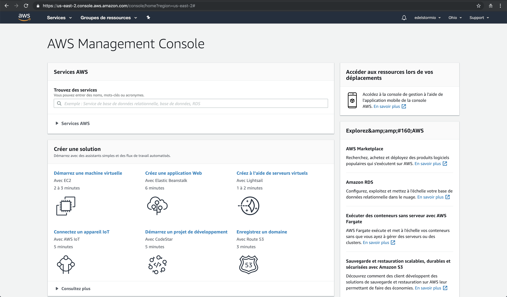

# Sign up to <small>- AWS</small>

!!! tip "Advice"
    At each step, you will find instructions but also images or animations. Use those to better understand what you have to do.

## Identification

***

Go to the <a href="https://portal.aws.amazon.com/billing/signup#/start" target="_blank">Amazon Web Services</a> website.

***

***

**Fill out the sign-up form**

:    * Put an e-mail address that you currently use.
:    * Create a password that has at least 8 characters, one capital letter, one number and a non-alphanumeric character like: <kbd>!</kbd> <kbd>@</kbd> <kbd>#</kbd> <kbd>(</kbd> <kbd>?</kbd>.
:    * Put your password a second time to be sure that you wrote it without any mistake.
:    * Choose a name for your AWS account. It can be your name, your company's name or your future website's name.
***

## Contact

***

**Fill out the contact form**

:    * Choose the account type.
:    * Put your full name.
:    * Put your phone number with the telephone area code of your country.
:    * Select your country.
:    * Put your address, city, state, and postcode.
:    * Check the box to agree with your <a href="https://aws.amazon.com/fr/agreement/" target="_blank">client contract</a>.
:    * Click on {==*Create an account and continue*==}.

***

## Payment Informations

!!! info "Things you need to know about the AWS offer"

    1. Opening an account is free. The costs will be depending on the services you use.
    2. The first month of using your <a href="/help/glossary" target="_blank">instance</a>, that will allow you to put your website online, is free.
    3. You will need to buy a domain name in the process of this training.
    4. You can easily have a look at the details of your <a href="https://console.aws.amazon.com/billing/home#/" target="_blank">billing</a>.
    5. At any moment, you can leave AWS without any hidden costs.

***

**Fill the credit card form**

:    * Put your card number.
:    * Put the expiration date.
:    * Put the full name of the cardholder.
:    * Select your billing address.
:    * You can now submit your information in a secure way by clicking on {==*Secure Submit*==}.

***

## Phone Check

!!! warning "Confirm your number"

    1. Have your phone near you because, in the next step, you will receive an automatic call from AWS.
    2. You will have to enter 4 numbers on your phone, that will appear on your computer screen.

***

**Phone number confirmation**

Now, AWS is going to check that you are a real person and not a robot.

:    * Select your country and type your phone number.
:    * Complete the Captcha by typing the letters and numbers that you can see on the image.
:    * Click on {==*Contact me*==}.

***

### AWS call

gif)

***

**AWS is calling you**

Type on your phone the four numbers you see on your computer screen.

***

### Confirmation

***

**Wait a minute...**

When this confirmation message appears on the screen, it means that the operation was a success. 
You can now click on {==Continue==}.

***

!!! warning "Possible incident"

      If, for any reason, you hang up the phone or get disconnected before you could type the code on your phone, keep the page open. Wait a few minutes, AWS is going to detect that a problem occurred and will ask you to try again. You will just have to click on {==Retry==}.

## Basic Plan

***

**You are now on the offers page**

:    * Choose the first offer *Basic Plan* by clicking on {==Free==}.
:    * Then, click on {==Sign in to the Console==}.

***

## Connexion

f)

***

**You can now connect to your AWS account**

:    * Put your account e-mail then click on {==Next==}.
:    * Put the password you chose, click on {==Connexion==}.

***

## Console

!!! success "Welcome on your Amazon Web Services administration console!"
    Don't forget to go check your e-mails and to click on the link sent by AWS to verify your e-mail!